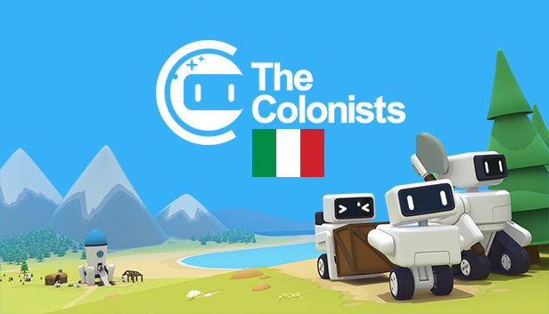

# The Colonists - Traduzione Italiana

Traduzione Italiana per The Colonists realizzata dalla comunità.

## Descrizione
Questo repository è utilizzato come bakup e controllo versione sul file di traduzione principale, ovvero il foglio di Google Sheets linkato qui sotto, in modo da tener traccia delle varie modifiche.

I file qui presenti non vengono modificati direttamente ma sono esportati da Google Sheets.

## Altri formati
Per facilitare la lettura o l'utilizzo dei dati, il file .csv esportato è anche convertito in JSON utilizzando [questo](https://www.csvjson.com/csv2json) convertitore.

**Attenzione:** il file json **non può** essere riconvertito a .csv con un convertitore, in quanto si genererebbero errori riguardo la presenza di virgole, virgolette e spazi a capo.

## Come utilizzo la traduzione?
La traduzione sarà inclusa nel gioco una volta completata al 100%.

## Link foglio traduzioni principale
Tutte le traduzioni per The Colonists sono visibili nel [relativo foglio](https://docs.google.com/spreadsheets/d/1laq8t0firN-AsQtYfEr1QiP1-qIWYtMLSixQ-P9Bwgk/edit?usp=sharing).

## Ho trovato un errore / voglio suggerirvi una modifica
Purtroppo la traduzione essendo fatta da una persona sola, potrebbe non essere perfetta.
Se trovi un errore nella traduzione o vuoi suggerire una modifica, per piacere apri una [issue](https://github.com/ScrappyCocco/TheColonistsItalian/issues).

## Autori Principali
* ScrappyCocco

## Verificatori
* Diego
